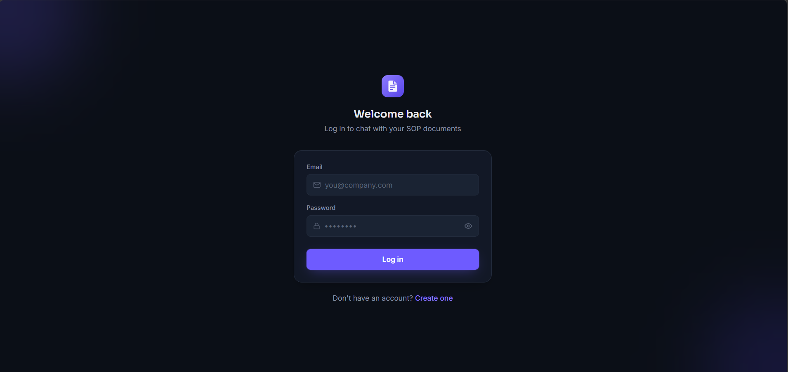
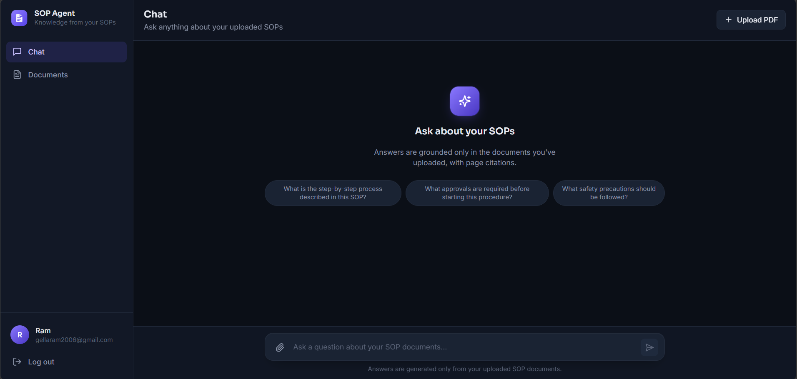
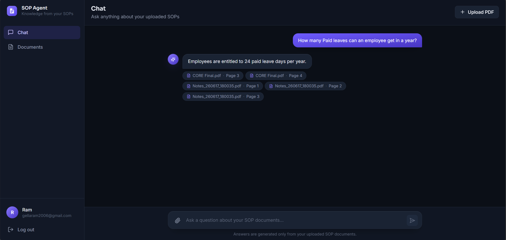

# 📄 SOP Agent

### AI-Powered SOP Question Answering using Retrieval-Augmented Generation (RAG)

Upload SOP PDF documents, ask questions, and get accurate AI-generated answers with source citations.

---

## 🚀 Overview

**SOP Agent** is a full-stack **RAG (Retrieval-Augmented Generation)** application built as a final-year engineering project.

Users can:

* Register / Login securely
* Upload SOP PDF documents
* Ask questions about uploaded SOPs
* Receive AI-generated answers with page citations

> If information is unavailable in uploaded documents, the AI responds:
> *I don't know. The information is not available in the uploaded SOP documents.*

---

## ✨ Features

* 🔐 JWT Authentication
* 📄 SOP PDF Upload
* 🔍 Semantic Search
* 🧠 RAG-based Question Answering
* 📌 Citation Support
* ⚡ Fast Groq Inference
* 💾 MongoDB Storage

---

## 📷 Screenshots

---

## 👨‍💻 Contributors

* Ram Gella
* Yashashwini KC
* Venkatesh Kalapati
* Pavani Palapati
