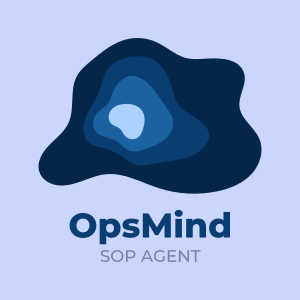

<p align="center">
  
</p>

<h1 align="center">📄 SOP Agent</h1>
<h3 align="center">AI-Powered SOP Question Answering using RAG</h3>

<p align="center">
  Upload SOP PDFs • Ask Questions • Get Citation-Based Answers
</p>

<p align="center">
  
  
  
  
</p>

---

# 🚀 Problem Statement

Organizations store Standard Operating Procedures (SOPs) as static PDF documents.  
Finding relevant information manually is slow, inefficient, and difficult.

SOP Agent solves this by enabling semantic search using AI-powered Retrieval-Augmented Generation (RAG).

---

# ✨ Features

| Feature | Status |
|---------|--------|
| User Authentication | ✅ |
| SOP PDF Upload | ✅ |
| Semantic Search | ✅ |
| RAG Pipeline | ✅ |
| Citation Support | ✅ |
| Groq Integration | ✅ |

---

# 🎬 Demo

(Optional: add demo GIF)

```md

```

---

# 📷 Screenshots

## Login Page


## Dashboard


## Chat Interface


---

# 🧠 RAG Architecture

```text
User Uploads PDF
        ↓
Text Extraction
        ↓
Chunking
        ↓
Embeddings Generation
        ↓
Vector Similarity Search
        ↓
Groq LLM
        ↓
Answer + Page Citation
```

---

# ⚙️ Workflow

1. User uploads SOP PDF  
2. PDF text extracted page-wise  
3. Content divided into chunks  
4. Embeddings generated  
5. Relevant chunks retrieved  
6. LLM generates grounded answer  
7. Citation returned with page references  

---

# 🛠 Tech Stack

| Layer | Technology |
|------|------------|
| Frontend | React + Vite + Tailwind CSS |
| Backend | Node.js + Express |
| Database | MongoDB Atlas |
| Authentication | JWT |
| LLM | Groq API |
| Embeddings | Transformers.js |

---

# 📁 Project Structure

```bash
SOP Agent/
│
├── assets/
│
├── README.md
│
└── sop-agent/
    ├── backend/
    │   ├── server.js
    │   ├── uploads/
    │   └── src/
    │       ├── config/
    │       ├── controllers/
    │       ├── middleware/
    │       ├── models/
    │       ├── routes/
    │       ├── services/
    │       └── utils/
    │
    └── frontend/
        ├── index.html
        ├── vite.config.js
        └── src/
            ├── api/
            ├── components/
            ├── context/
            └── pages/
```

---

# 🔌 API Endpoints

| Method | Route | Description |
|--------|-------|-------------|
| POST | `/api/auth/register` | Register user |
| POST | `/api/auth/login` | Login |
| GET | `/api/auth/me` | User Profile |
| GET | `/api/documents` | Get documents |
| POST | `/api/documents/upload` | Upload PDF |
| DELETE | `/api/documents/:id` | Delete document |
| POST | `/api/chat/ask` | Ask question |

---

# 📊 Performance Metrics

| Metric | Value |
|--------|-------|
| Response Time | ~2 sec |
| Embedding Dimension | 384 |
| Top K Retrieval | 5 |
| Model | llama-3.1-8b |

---

# ⚙️ Installation

## Clone Repository

```bash
git clone https://github.com/Ramgella/SOP-Agent.git
cd SOP-Agent
```

## Backend Setup

```bash
cd sop-agent/backend
npm install
npm run dev
```

Configure `.env`

```env
PORT=5000
MONGO_URI=your_mongodb_uri
JWT_SECRET=your_secret
GROQ_API_KEY=your_api_key
```

## Frontend Setup

```bash
cd ../frontend
npm install
npm run dev
```

Frontend:

```text
http://localhost:5173
```

---

# 🔮 Future Enhancements

- OCR for scanned PDFs  
- Voice Queries  
- Chat History  
- Multi-language Support  
- Analytics Dashboard  

---

# 👨‍💻 Contributors

- Ram Gella — Full Stack / AI Integration  
- Yashashwini KC — Frontend  
- Venkatesh Kalapati — Backend  
- Pavani Palapati — Database  

---

# 📜 License

Academic Project — Educational Use Only

---

<p align="center">
Built with ❤️ by Team SOP Agent
</p>
